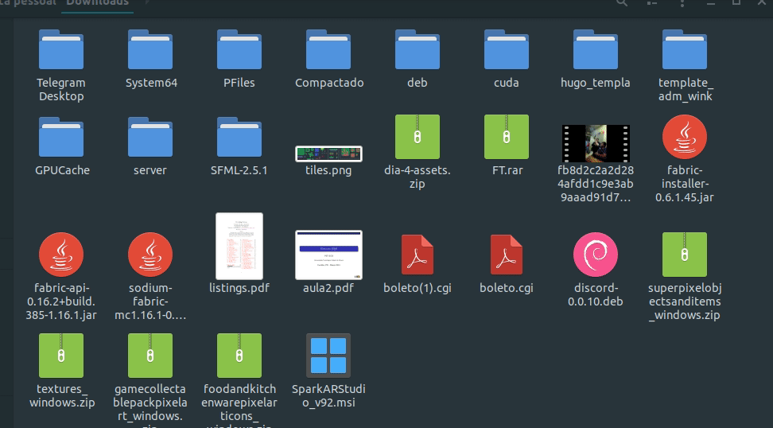

# autoshuffle

Este é um código tem como objetivo de manter sua pasta de Download organizada, alocando os arquivos em suas respectivas pastas de destino.

O código está com as pastas de origem de acordo com a minha disposição de pastas, então deve ser alterado caso for usado em outro computador ou implementado para funcionar em outra pasta.

